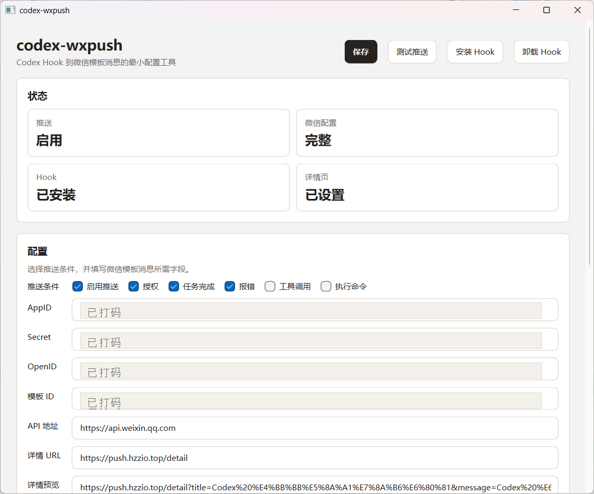

# codex-wxpush

Codex hook 微信模板消息提醒工具。程序常驻 Windows 托盘，在 Codex 触发授权、完成、报错、工具调用或执行命令事件时，按配置推送微信测试号模板消息。



## 功能

- 托盘常驻，不弹终端窗口
- 当前用户开机启动
- 一键安装 / 卸载 Codex hooks
- 微信测试号模板消息推送
- 推送条件多选：
  - 报错
  - 授权
  - 任务完成
  - 工具调用
  - 执行命令
- 详情页 URL 自动追加 `title`、`message`、`date`
- 独立 hook helper：`codex-wxpush-hook.exe`

## 构建

依赖：

- Windows
- CMake 3.21+
- Visual Studio 2022 C++ toolchain
- Qt 6 Widgets / Network

示例：

```powershell
cmake -S . -B build -DCMAKE_PREFIX_PATH=C:\Qt\6.8.3\msvc2022_64
cmake --build build --config Release
```

构建产物：

```text
build\Release\codex-wxpush.exe
build\Release\codex-wxpush-hook.exe
```

`codex-wxpush.exe` 是 GUI/托盘程序；`codex-wxpush-hook.exe` 是 Codex hook 专用控制台 helper。

## 使用

1. 运行：

```powershell
build\Release\codex-wxpush.exe
```

2. 在托盘菜单打开控制台。
3. 填写微信测试号配置：
   - AppID
   - Secret
   - OpenID
   - 模板 ID
   - API 地址
   - 详情 URL
4. 勾选需要的推送条件。
5. 点击 `保存`。
6. 点击 `测试推送` 确认微信能收到消息。
7. 点击 `安装 Hook`。

需要直接打开窗口调试时：

```powershell
build\Release\codex-wxpush.exe --window
```

## 微信测试号配置

如果还没有微信测试号，可以按下面步骤准备参数。

1. 打开 [微信公众平台接口测试帐号申请](https://mp.weixin.qq.com/debug/cgi-bin/sandbox?t=sandbox/login)。

   参考图：[wx1.png](https://github.com/hezhizheng/go-wxpush/blob/master/img/wx1.png)

2. 获取 `appid` 和 `appsecret`。

   参考图：[wx2.png](https://github.com/hezhizheng/go-wxpush/blob/master/img/wx2.png)

3. 关注测试公众号，获取接收用户 `OpenID`，新增测试模板并获取 `template_id`。

   模板内容建议写成：

   ```text
   内容: {{content.DATA}}
   ```

   不建议只填写 `{{content.DATA}}`。前面加一点文案可以避免部分情况下推送正文不显示。

   参考图：[wx3.png](https://github.com/hezhizheng/go-wxpush/blob/master/img/wx3.png)

4. 将 `appid`、`appsecret`、`OpenID`、`template_id` 填入 `codex-wxpush` 控制台，然后点击 `测试推送`。

   参考图：[w0.jpg](https://github.com/hezhizheng/go-wxpush/blob/master/img/w0.jpg)、[w1.jpg](https://github.com/hezhizheng/go-wxpush/blob/master/img/w1.jpg)

## Codex Hook

安装后会写入：

```text
%USERPROFILE%\.codex\hooks.json
```

目前安装这些事件：

```text
PermissionRequest
Stop
PreToolUse
PostToolUse
```

Hook 命令指向：

```powershell
codex-wxpush-hook.exe --hook
```

hook payload 从 stdin 读取 JSON。

## 可识别字段

事件名：

```text
hook_event_name
hookEventName
event
event_name
name
hook.event
CODEX_HOOK_EVENT
```

工具：

```text
tool
tool_name
toolName
```

命令：

```text
command
cmd
tool_input.command
input.command
```

目录：

```text
cwd
workspace
project_dir
```

错误：

```text
error
error_message
```

## 命令行

安装 hook：

```powershell
build\Release\codex-wxpush-hook.exe --install-hooks
```

卸载 hook：

```powershell
build\Release\codex-wxpush-hook.exe --uninstall-hooks
```

手动测试发送：

```powershell
build\Release\codex-wxpush.exe --send -title "Codex 测试" -content "这是一条测试消息"
```

模拟 hook：

```powershell
$payload = @{
  hook_event_name = "Stop"
  cwd = (Get-Location).Path
  tool = "codex"
  message = "Codex 本轮任务已完成。"
} | ConvertTo-Json -Compress

$payload | build\Release\codex-wxpush-hook.exe --hook
```

## 开机启动

在控制台勾选 `开机启动` 并保存后，会写入当前用户注册表：

```text
HKCU\Software\Microsoft\Windows\CurrentVersion\Run\codex-wxpush
```

取消勾选并保存会删除该启动项。

## 日志

日志路径由 Qt `AppConfigLocation` 决定，Windows 下通常是：

```text
%LOCALAPPDATA%\codex-wxpush\codex-wxpush\codex-wxpush.log
```

控制台里可以查看最近日志，也可以打开完整日志文件。

## 感谢与参考

- 感谢并参考 [hezhizheng/go-wxpush](https://github.com/hezhizheng/go-wxpush) 的微信测试号配置说明和示例图片；README 中仅保留图片链接，避免直接展开可能包含参数的截图。
- 友链：[LINUX DO](https://linux.do/)
